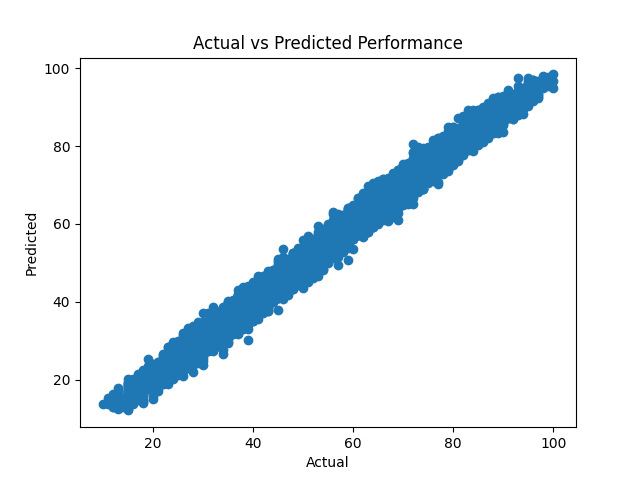
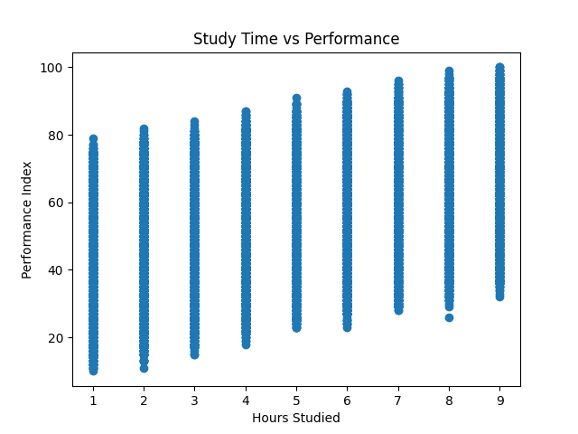

# 🎓 AI Trainer

A machine learning project that predicts student performance based on study habits and lifestyle factors.

---

## 🚀 Features

* Train a machine learning model using real student data
* Predict student performance from user input
* Visualize model accuracy with graphs
* Save and reuse trained models
* Clean CLI-based workflow

---

## 📊 Dataset

The dataset includes:

* Hours Studied
* Previous Scores
* Extracurricular Activities
* Sleep Hours
* Sample Question Papers Practiced
* Performance Index (target)

---

## 🧠 Model

* Algorithm: Linear Regression
* Evaluation Metric: Mean Absolute Error (MAE)

---

## 📈 Visualizations

### Actual vs Predicted



### Study Time vs Performance



---

## ⚙️ Installation

```bash
cd ai-trainer
pip install -r requirements.txt
```

---

## 🏋️ Train the Model

```bash
cd src
python train.py
```

---

## 🔮 Make Predictions

```bash
python predict.py --hours 6 --previous 85 --activities 1 --sleep 7 --papers 5
```


## 📂 Project Structure

```
ai-trainer/
│
├── data/        # Dataset
├── images/      # Saved graphs
├── models/      # Trained model
├── src/         # Source code
├── requirements.txt
└── README.md

